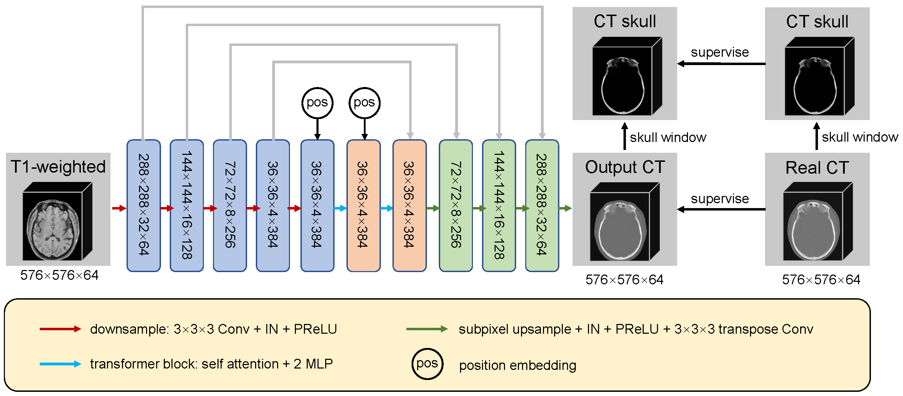

# mr2ct
Supervised training for translation from MRI-T1w to CT using aligned data.

## Overview
工程文件总览：
```
mr2ct/
├── README.md
├── preprocess_paired_mr_ct  # 数据预处理
├── data  # 数据存放目录
│   ├── synthstrip  # synthstrip去头骨模型
│   ├── Dataset141_CTHeadMask.tar.gz  # nnunetv2头部掩膜数据集
│   ├── test_data  # 测试预处理代码
│   ├── dcm2nii    # DICOM数据转换为NIFTI数据
├── configs  # 配置文件
├── datasets # 数据加载及组织
├── models   # 模型定义
├── trainer  # 模型训练
├── utils    # 工具函数
├── scripts  # 训练脚本
├── figures  # 相关图示
├── mr2ct_t12ct_one_example.py  # 单个MR图像推理脚本
├── mr2ct_t12ct_multistage_eval.py  # 多阶段模型评估
```

## Data preparing
主要介绍对MR和CT配对数据的预处理流程。

步骤
1. 安装nnunetv2
2. 将Dataset141_CTHeadMask.tar.gz 解压至为nnunetv2设定的`nnUNet_results`环境变量位置
   1. 例如，若nnUNet_results="/data/dingsd/nnunetv2/nnunetv2_datasets/nnUNet_results"
   2. 则执行，`tar -zxvf /path/of/Dataset141_CTHeadMask.tar.gz $nnUNet_results`
3. 安装synthstrip去头骨
   1. `pip install surfa`
   2. 将`synthstrip.1.pt`放置于`data/synthstrip`目录下
4. 运行`bash preprocess_paired_mr_ct/pipeline.sh /path/to/data_root_dir`，进行数据预处理，预处理后的结果会直接存放在`/path/to/data_root_dir`下，预处理包含
   1. 针对CT数据，预处理包含：nnunetv2头部掩膜提取、N4偏置场校正、利用头部掩膜将头外区域置为-1024
   2. 针对MR数据，预处理包含：N4偏置场校正、OTSU头部掩膜提取、利用头部掩膜将头外区域置为0


`/path/to/data_root_dir`的组织方式要求如下：
```
data_root_dir/
├── ct
│   ├── patient1_0000.nii.gz
|   ├── patient2_0000.nii.gz
│   └── ...
└── mr
    ├── patient1_0000.nii.gz
    ├── patient2_0000.nii.gz
│   └── ...
```
运行预处理后，`/path/to/data_root_dir`的主要组织方式会变为：
```
data_root_dir/
├── ct
│   ├── patient1_0000.nii.gz
│   ├── patient2_0000.nii.gz
│   └── ...
└── ct_headmask
│   ├── patient1_0000.nii.gz
│   ├── patient2_0000.nii.gz
│   └── ...
├── headct_reg2_mr   # 模型训练用：最终预处理后且与MR配准的CT数据
│   ├── patient1_0000.nii.gz
│   ├── patient1_0000_headmask.nii.gz
│   ├── patient2_0000.nii.gz
│   ├── patient2_0000_headmask.nii.gz
│   └── ...
├── mr
│   ├── patient1_0000.nii.gz
│   ├── patient2_0000.nii.gz
│   └── ...
└── pre_head_mr      # 模型训练用：预处理后的MR数据
    ├── patient1_0000.nii.gz
    ├── patient1_0000_headmask.nii.gz
    ├── patient2_0000.nii.gz
    ├── patient2_0000_headmask.nii.gz
    └── ...
```

## Training
网络模型见下图。

模型训练采用分阶段训练方法，按照切patch方式进行，从小patch进行快速训练，再分三个阶段，利用前一阶段的训练权重，逐步增大图像patch进行训练，最终引入transformer结构和window loss。

执行模型训练，模型训练时会读取`headct_reg2_mr`和`pre_head_mr`目录下的CT和MR数据，生成一个包含训练和验证数据的`data/mr2ct_cyclegan.json`文件：
```
bash scripts/run_train_t12ct.sh
```

Tips: 可以不分阶段，直接使用最大图像patch训练，执行
```
bash scripts/run_train_t12ct_end2end.sh
```

```
Warning：本MR2CT模型训练未改变CT图像HU值范围，故整体训练可能存在不稳定性，后续训练可考虑对CT值进行归一化，后续推理后再进行HU值反归一化。
```

## Inference
对于单个MR图像进行推理，可以执行：
```
python mr2ct_t12ct_one_example.py
```

## Evaluation
对于训练后的模型进行评估，可以执行
```
python mr2ct_t12ct_multistage_eval.py
```
对模型进行评估。本脚本会直接加载之前训练的各个阶段的模型，也加载MR数据的验证集（存储在`data/mr2ct_cyclegan.json`文件中），进行模型评估。

评估指标主要有CT值各HU范围内的平均绝对误差MAE。
