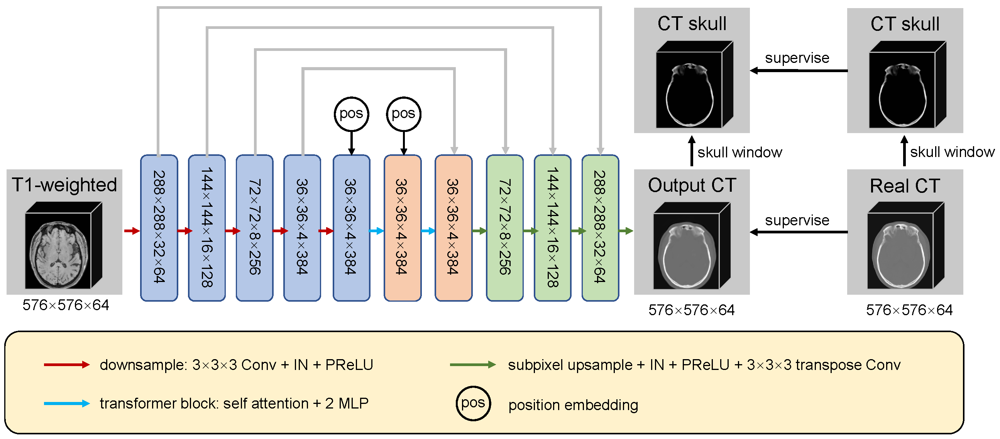

# mr2ct
Supervised training for translation from MRI-T1w to CT using aligned data.

## Overview
Project file overview:
```
mr2ct/
├── README.md
├── preprocess_paired_mr_ct  # Data preprocessing
├── data  # Data storage directory
│   ├── synthstrip  # synthstrip skull stripping model
│   ├── Dataset141_CTHeadMask.tar.gz  # nnunetv2 head mask dataset
│   ├── test_data  # Test preprocessing code
│   ├── dcm2nii    # DICOM to NIFTI data conversion
├── configs  # Configuration files
├── datasets # Data loading and organization
├── models   # Model definitions (unused)
├── trainer  # Model training
├── utils    # Utility functions, including UNet model definition
├── scripts  # Training scripts
├── figures  # Related diagrams
├── used_scripts  # Previously used one-time scripts, potentially useful
├── mr2ct_t12ct_one_example.py  # Single MR image inference script
├── mr2ct_t12ct_multistage_eval.py  # Multi-stage model evaluation
```

## Data preparing
Main introduction to the preprocessing pipeline for paired MR and CT data.

Steps:
1. Install nnunetv2
2. Extract Dataset141_CTHeadMask.tar.gz to the `nnUNet_results` environment variable location set for nnunetv2
   1. For example, if nnUNet_results="/data/dingsd/nnunetv2/nnunetv2_datasets/nnUNet_results"
   2. Execute: `tar -zxvf /path/of/Dataset141_CTHeadMask.tar.gz $nnUNet_results`
3. Install synthstrip for skull stripping
   1. `pip install surfa`
   2. Place `synthstrip.1.pt` in the `data/synthstrip` directory
4. Run `bash preprocess_paired_mr_ct/pipeline.sh /path/to/data_root_dir` for data preprocessing. The preprocessed results will be stored directly in `/path/to/data_root_dir`. Preprocessing includes:
   1. For CT data: nnunetv2 head mask extraction, N4 bias field correction, setting regions outside the head to -1024 using the head mask
   2. For MR data: N4 bias field correction, OTSU head mask extraction, setting regions outside the head to 0 using the head mask

The required organization of `/path/to/data_root_dir` is as follows:
```
data_root_dir/
├── ct
│   ├── patient1_0000.nii.gz
|   ├── patient2_0000.nii.gz
│   └── ...
└── mr
    ├── patient1_0000.nii.gz
    ├── patient2_0000.nii.gz
│   └── ...
```
After running preprocessing, the main organization of `/path/to/data_root_dir` will become:
```
data_root_dir/
├── ct
│   ├── patient1_0000.nii.gz
│   ├── patient2_0000.nii.gz
│   └── ...
└── ct_headmask
│   ├── patient1_0000.nii.gz
│   ├── patient2_0000.nii.gz
│   └── ...
├── headct_reg2_mr   # For model training: final preprocessed CT data registered to MR
│   ├── patient1_0000.nii.gz
│   ├── patient1_0000_headmask.nii.gz
│   ├── patient2_0000.nii.gz
│   ├── patient2_0000_headmask.nii.gz
│   └── ...
├── mr
│   ├── patient1_0000.nii.gz
│   ├── patient2_0000.nii.gz
│   └── ...
└── pre_head_mr      # For model training: preprocessed MR data
    ├── patient1_0000.nii.gz
    ├── patient1_0000_headmask.nii.gz
    ├── patient2_0000.nii.gz
    ├── patient2_0000_headmask.nii.gz
    └── ...
```

## Training
The network model is shown in the figure below.

Model training adopts a multi-stage training approach using patch-based method, starting with small patches for fast training, then progressing through three stages using weights from the previous stage, gradually increasing image patch size for training, and finally introducing transformer structure and window loss.

To execute model training, the training process will read CT and MR data from `headct_reg2_mr` and `pre_head_mr` directories and generate a `data/mr2ct_cyclegan.json` file containing training and validation data:
```
bash scripts/run_train_t12ct.sh
```

Tips: You can skip the multi-stage approach and directly train with the largest image patches by executing:
```
bash scripts/run_train_t12ct_end2end.sh
```

```
Warning: This MR2CT model training does not modify the CT image HU value range, so overall training may have instability issues. Future training should consider normalizing CT values and performing HU value denormalization after inference.
```

## Inference
For inference on a single MR image, execute:
```
python mr2ct_t12ct_one_example.py
```

## Evaluation
To evaluate the trained model, execute:
```
python mr2ct_t12ct_multistage_eval.py
```
for model evaluation. This script will directly load previously trained models from various stages and also load the MR data validation set (stored in the `data/mr2ct_cyclegan.json` file) for model evaluation.

The evaluation metrics mainly include Mean Absolute Error (MAE) for CT values within various HU ranges.